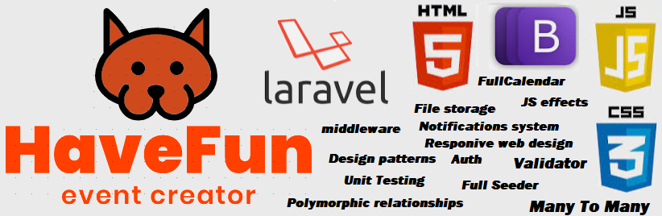
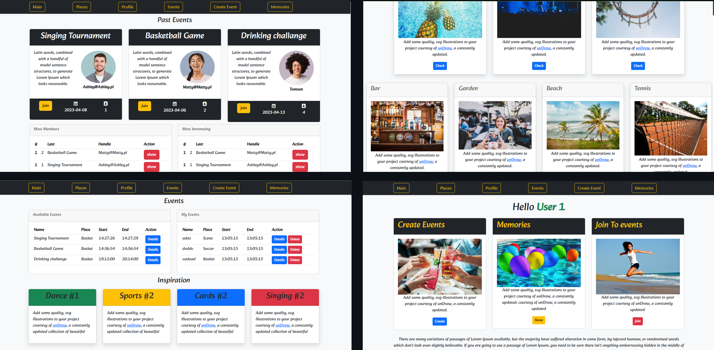
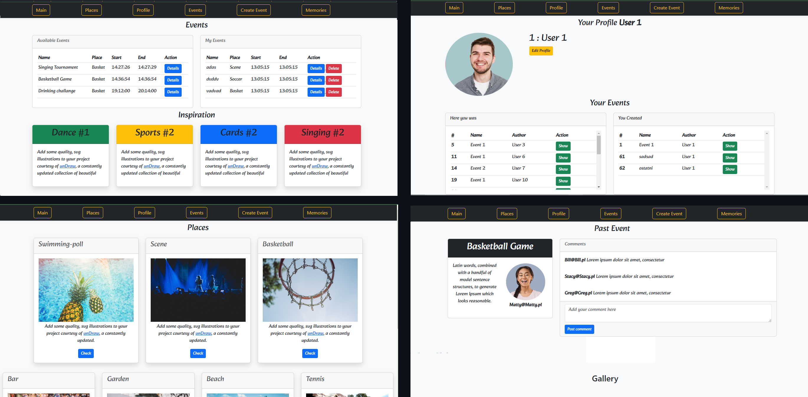

# Description

You are on vacation and you have no idea how to spend the day. You don't necessarily have to invent it. An application that enables better integration between hotel guests.

</img>

Resorts have different facilities. E.g. tennis courts, sports fields, swimming pools, stages, etc.
The application allows users to create their own events, tournaments, competitions, games,
inviting other users. A dance competition, a basketball game, a beer drinking tournament? 

# Why not!

</img>

The application gives you the opportunity to create an event on facilities in the hotel or without.
Other users can sign up for the event.
Notification system from favorite users.

After the events, the ability to post your own photos under the event and comment.
Full management on available models.
The application takes into account the limited availability of objects.

</img>

Convenient management panel with a detailed view of how
-descriptions, time, registered people
-availability of facilities
-preview of past events along with a user-created gallery and comments.
-list of current events